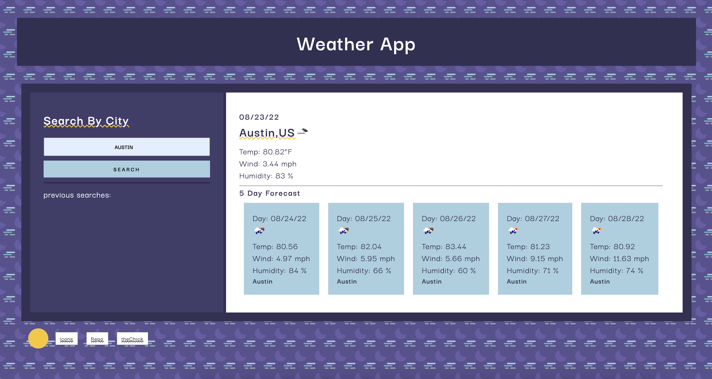

# Weather Dashboard

In this application we are using the OpenWeather API to get real time weather specs from one city. You are able to search by city and you will recieve that cities weather inforamtion as well as a 5 day forecast. 

### Installation

The user is able to search in the city box and the information will dynamically appear on the right of the page. 

### Challenges

One of the challenges I faced was retrieving the stored city inputs from local storage and adding them to the 'recent' searched field.

### Mockup

### Deployed Website

https://thechicketarian.github.io/Weather-Application/
